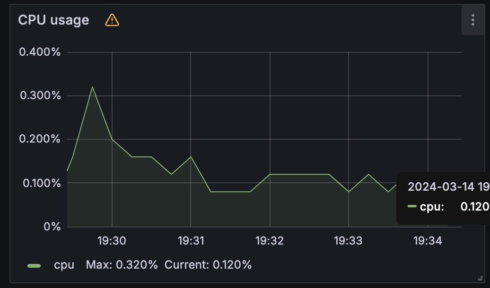

# DevOps/SRE Exercise - Commit Viewer

## Part 1 - Design:

The next schema provides the platform’s architecture on AWS.

All platform’s architecture will be hosted on a Virtual Private Cloud (VPC). The client will communicate with all the services via an endpoint provided by AWS Route 53 that will connect to an Ingress resource. This resource will be on a Kubernetes cluster. In this cluster, we will have 2 nodes for fault tolerance, scalability and resilience and each one will be running on a VM on a private subnet. Each node will have the required replica pods and each pod will be an application’s microservice. There is also a rabbitmq statefulset to provide the asynchronous communication between the different microservices. 
Additionally, it will be necessary to create all IAM roles and permissions for the Kubernetes resources to communicate with the Databases, Secret Manager and Docker registry. The 2 Databases will run on EC2 virtual machines. PostegreSQL for the Project microservice and MongoDB for the Commit microservice. The Secret manager is crucial since we will need to store sensitive information like passwords for authentication. The Docker registry is required to upload and store the docker images for all the application’s microservices.
Finally, Amazon Cloudfront service will be used for caching. If the user has already requested the content, then the request will be forwarded to Cloudfront, otherwise it will be forwarded to the endpoint where that content is and it will be store in Cloudfront for the same subsequent requests.
It is also noteworthy to mention the Prometheus, Grafana and Pagerduty integration. Prometheus is used to scrape the metrics being exposed by the microservices, Grafana for dashboard's visualization and Pagerduty to generate alerts from these metrics.

## Part 2 - List commits:

The wrapper was implemented to use the git CLI by invoking shell commands to provide a list of commits for a given GitHub URL.

First, we create a temporary directory to perform operations, then we initialize an empty git repository, add the remote repository,
fetch all branches from the remote repository and retrieve the commit list. Finally, we parse the list of commit hashes into data structure
of type Dict.

Usage for unix systems:

* Go to wrapper folder

* `chmod +x wrapper.py`

* `ln -s /path/to/codacy/wrapper/wrapper.py /usr/local/bin/codacy-git`

* `codacy-git --list-commits <Github_URL>`

There is also unit testing file called test_wrapper.py for this wrapper. First, it creates a temporary directory for testing, creates an instance of GitWrapper and calls the list_commits method to retrieve the commits for the given GitHub URL. Finally, asserts if the number fo commits is 
correct or not. We could also implement more tests to test the git cli using shell commands.

Usage:

* `python3 test_wrapper.py <Github_URL>`

## Part 3 - API:

1. Endpoint for retrieving a list of commits for a given GitHub URL. This endpoint uses the code implemented in Part2 to retrieve the commits and then returns a json containing those commits:

* Start server: `python3 api.py`
* Method: GET
* Path: /list-commits
* Response: Json of commits or error messages
* Example for testing: `curl -X GET http://localhost:8080/list-commits\?url\=<Github_URL>`

There is also unit testing file called test_api.py for this Flask API. First, it sets up the Flask test client, Make a request to the list-commits endpoint to retrieve the commits for the given GitHub URL. Finally, Check the response and status code. Eventually, we could also implement more tests to test more cases.

Usage:

* `python3 test_api.py <Github_URL>`

## Part 4 - Run it Docker:

Dockerfile for the Flask Python Api and the docker-compose.yaml file for three services:

* Flask API
* Prometheus for scraping metrics
* Grafana for dashboard's visualization

Usage:

* `docker-compose up -d`

## Part 5 - Monitoring:

**Metrics exposed to Prometheus for the Grafana dashboard visualization:**

1. **Requests per second**:

* Metric: flask_http_request_duration_seconds_count
* Query: rate(flask_http_request_duration_seconds_count{status="200"}[30s])

2. **Average response time[30s]**:
* Metrics: flask_http_request_duration_seconds_sum, flask_http_request_duration_seconds_count
* Query: rate(flask_http_request_duration_seconds_sum{status="200"}[30s])/rate(flask_http_request_duration_seconds_count{status="200"}

3. **Errors per second**:
* Metric: flask_http_request_duration_seconds_count
* Query: sum(rate(flask_http_request_duration_seconds_count{status!="200"}[30s]))

4. **Total requests per minute**:
* Metric: flask_http_request_total
* Query: increase(flask_http_request_total[1m])

5. **Request duration[s] - p50**:
* Metric: flask_http_request_duration_seconds_bucket
* Query: histogram_quantile(0.5, rate(flask_http_request_duration_seconds_bucket{status="200"}[30s]))

6. **Request duration[s] - p90**:
* Metric: flask_http_request_duration_seconds_bucket
* Query: histogram_quantile(0.9, rate(flask_http_request_duration_seconds_bucket{status="200"}[30s]))

7. **Requests under 250ms**:
* Metrics: flask_http_request_duration_seconds_bucket, flask_http_request_duration_seconds_count
* Query: increase(flask_http_request_duration_seconds_bucket{status="200",le="0.25"}[30s])/ignoring (le) increase(flask_http_request_duration_seconds_count{status="200"}[30s])

8. **Memory usage**:
* Metric: process_resident_memory_bytes
* Query: process_resident_memory_bytes{job="commit_api"}

9. **CPU usage**:
* Metric: process_cpu_seconds_total
* Query: rate(process_cpu_seconds_total{job="commit_api"}[30s])

